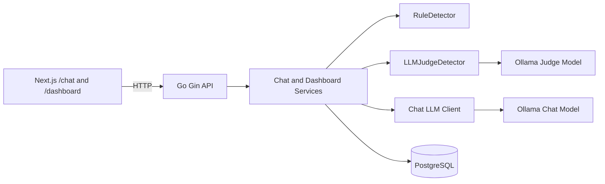

# LLM Security Monitor

Next.js + Go + PostgreSQL で構成した、セキュリティ監視付きLLMチャットMVPです。ユーザー入力とLLM出力をDBへ保存し、Prompt Injection、Jailbreak、System Prompt Leak、機密情報漏えいなどを Go のルール検知と LLM Judge で検知します。

## 技術スタック

- Frontend: Next.js App Router, TypeScript, Tailwind CSS, lucide-react
- Backend: Go, Gin, GORM
- DB: PostgreSQL
- LLM: Ollama first、Gemini/OpenAI はプロバイダ切替用の拡張ポイントを用意
- Detection: RuleDetector, LLMJudgeDetector, Pre-check, Post-check

## アーキテクチャ



## 起動方法

```bash
cp .env.example .env
docker compose up --build
```

Ollama のモデルが未取得の場合は、別ターミナルで次を実行してください。

```bash
docker compose exec ollama ollama pull llama3.1
```

Frontend: `http://localhost:3000`

Backend health: `http://localhost:8080/health`

## 環境変数

- `DATABASE_URL`: PostgreSQL 接続URL
- `BACKEND_PORT`: Go API のポート
- `FRONTEND_PORT`: Next.js のポート
- `NEXT_PUBLIC_BACKEND_URL`: ブラウザから見えるGo API URL
- `CORS_ALLOWED_ORIGINS`: Go API の許可オリジン
- `OLLAMA_BASE_URL`: Ollama API URL
- `OLLAMA_CHAT_MODEL`: チャット用モデル
- `OLLAMA_JUDGE_MODEL`: Judge用モデル
- `GEMINI_API_KEY`: Gemini用の将来拡張
- `OPENAI_API_KEY`: OpenAI用の将来拡張
- `DEFAULT_CHAT_PROVIDER`: 既定のチャットプロバイダ
- `DEFAULT_JUDGE_PROVIDER`: 既定のJudgeプロバイダ
- `ALLOW_LLM_FALLBACK`: LLM接続失敗時に安全な代替応答でログ保存を継続
- `SYSTEM_PROMPT`: チャット用システムプロンプト

## API一覧

- `GET /health`
- `POST /api/chat`
- `GET /api/conversations`
- `GET /api/conversations/:id/messages`
- `GET /api/dashboard/risk-events`
- `GET /api/dashboard/risk-summary`
- `GET /api/dashboard/conversations/:id`
- `GET /api/dashboard/detector-runs?requestId=...`
- `GET /api/dashboard/detector-runs/:requestId`

## DBテーブル

- `conversations`: 会話単位のメタデータ
- `messages`: user / assistant メッセージ
- `llm_requests`: LLM呼び出し、入力、出力、トークン、レイテンシ
- `risk_events`: 検知結果。全イベントを source 別に保存
- `detector_runs`: LLM Judge の入出力、成功/失敗、パース失敗ログ

マイグレーションは `backend/migrations` にあり、バックエンド起動時に未適用分を実行します。

## 検知カテゴリ

`prompt_injection`, `jailbreak`, `system_prompt_leak_attempt`, `system_prompt_leak_success`, `sensitive_info_request`, `sensitive_info_leak`, `tool_abuse`, `rag_injection`, `policy_bypass`, `benign`

## ルールベース検知

`backend/internal/detector/rule.go` に実装しています。日本語と英語のキーワードを検知し、`type`, `severity`, `score`, `evidence`, `reason`, `source` を持つイベントへ変換します。Pre-check は user input、Post-check は user input と model output を対象にします。

## LLM Judge検知

`backend/internal/detector/llm_judge.go` に実装しています。Judgeプロンプトでは user input / model output を未信頼データとして扱うことを明示し、JSONのみを返すよう要求します。JSONパースやバリデーションに失敗した場合は `detector_runs` に失敗として保存し、チャット処理自体は継続します。

## リスク統合

同じ `type` のイベントはレスポンス上では最高スコアを代表として表示します。DBには元イベントをすべて保存します。最終スコアは最大 `score`、confidence は rule と llm_judge が同じカテゴリを検知した場合に `high` になります。

## 画面

- `/chat`: モデル選択、会話履歴、送信フォーム、最新リスク表示
- `/dashboard`: severity/source/category 集計、直近イベント、高スコア会話
- `/dashboard/conversations/[id]`: 会話全文、evidence ハイライト、rule と LLM Judge 比較、detector_runs 詳細

## セキュリティ上の注意

- `system_prompt` はAPIレスポンスに含めません。
- APIキーや `.env` の内容をレスポンスに含めません。
- LLM Judge の対象テキストはすべて未信頼としてプロンプトに明記しています。
- Judge出力はJSONとしてパースし、カテゴリとseverityを検証します。
- エラー時は内部詳細を返さず、必要な詳細はサーバーログか `detector_runs` に保存します。

## 今後追加したい機能

- Gemini / OpenAI クライアントの実装
- ログ保存時のマスキングポリシー
- 認証とプロジェクト単位の権限管理
- リスクイベントのCSV/JSONエクスポート
- ルールセットの管理画面
- Webhook / Slack 通知
